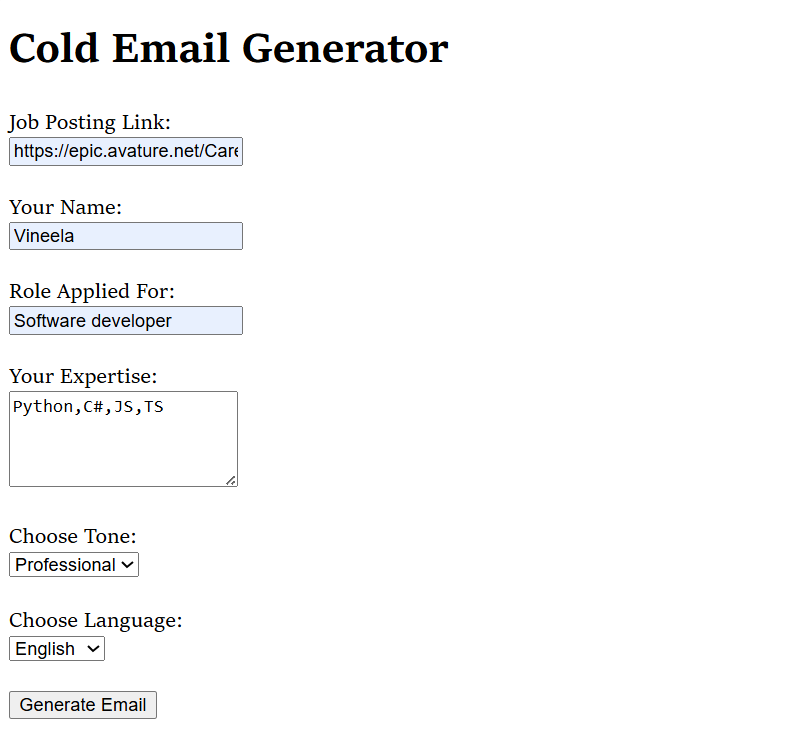
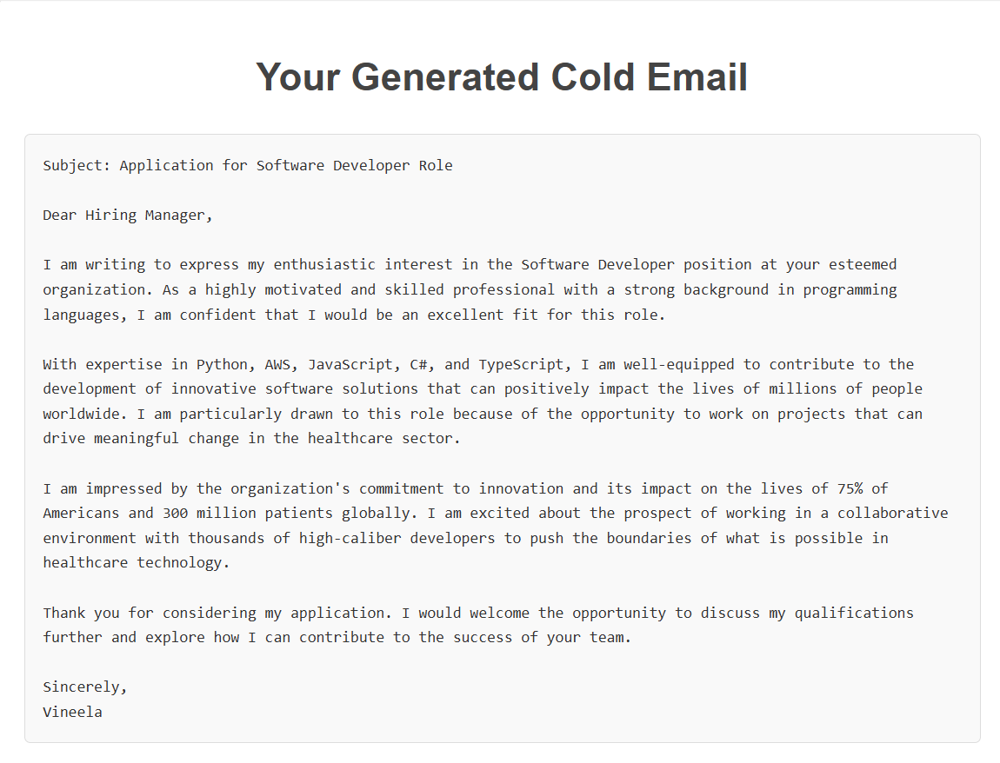

# 📨 **Cold Email Generator**

### 🚀 **Overview**
The **Cold Email Generator**  is a Flask-based web application that simplifies the process of creating impactful, personalized cold emails. Whether you're applying for a job or reaching out for networking opportunities, this tool analyzes job postings and matches your expertise to generate tailored emails in multiple tones and languages.

Gone are the days of staring at a blank email screen—this application ensures you put your best foot forward every time.

---

## **🛠️ Features**

### **Job Posting Analysis**
- Extracts job roles, skills, and descriptions directly from job posting links.
- Provides structured information for generating personalized emails.

### **Skill Match Scoring**
- Matches your expertise to job requirements using **cosine similarity** for a quantified skill match score.

### **Email Customization**
- Generate emails in multiple tones:
  - **Professional**: For formal communication.
  - **Casual**: For friendly, approachable outreach.
  - **Persuasive**: To highlight why you're the perfect fit.
- Supports email generation in three languages:
  - **English**
  - **Spanish**
  - **French**

### **User-Friendly Interface**
- Simple form-based input for ease of use.
- Responsive output with preserved formatting for professional presentation.

---

## **📋 How to Use**

1. **Access the App**: Run the Flask app locally and open it in your browser at `http://127.0.0.1:5000`.
2. **Fill Out the Form**:
   - Enter the job posting link.
   - Provide your name, role, and expertise.
   - Select the desired tone and language for the email.
3. **Generate Email**: Click the "Generate Email" button to receive a tailored email.
4. **Copy the Email**: Review and copy the generated email displayed on the results page.

---
## **📷 Screenshots**

### **Input Form**

### **Generated Email Output**

---

## **💡 Future Enhancements**

- **More Tones**: Add support for additional tones such as empathetic, authoritative, and friendly.
- **Additional Languages**: Expand beyond English, Spanish, and French to support global accessibility.
- **Mobile Responsiveness**: Optimize the UI for mobile devices for on-the-go users.
- **Template Customization**: Allow users to modify email templates or create their own.

---

